# DEVOPS

## Git

Un système de gestion de versions décentralisé, inventé par Linus Torvalds pour le développement du noyau Linux en 2005.

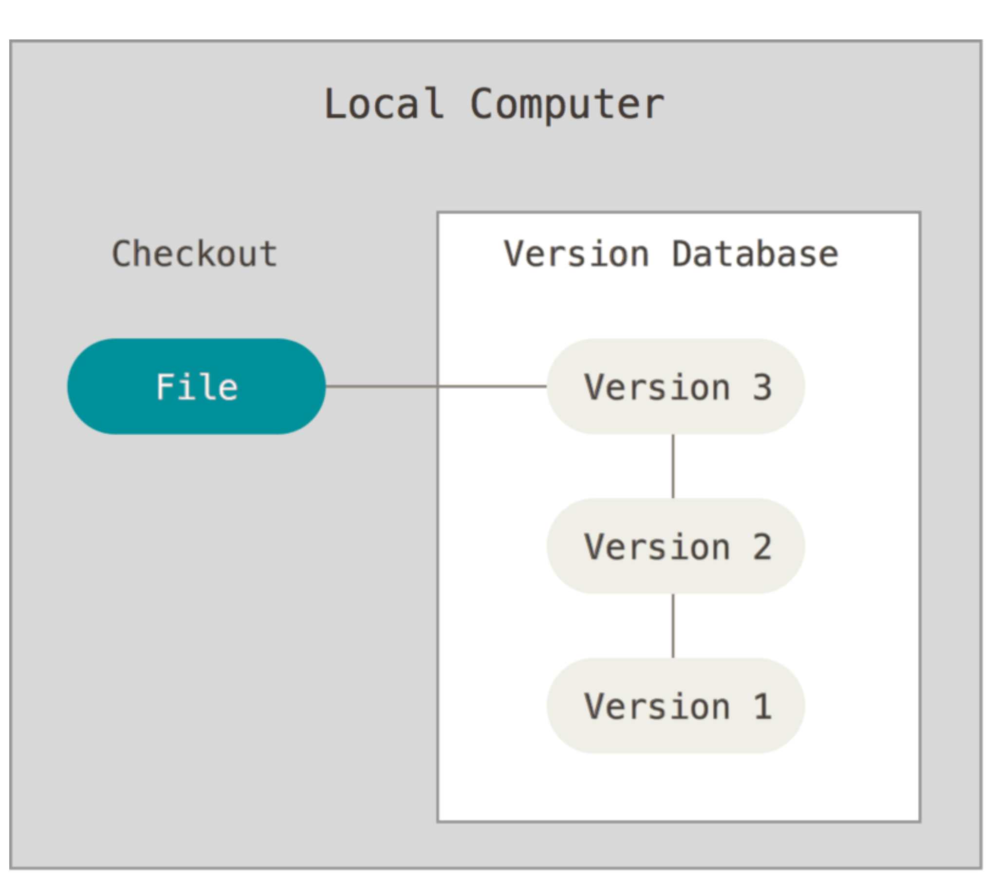

On parle de SCM distribué (Distributed Source Control Management). Il permet de travailler en mode déconnecté, de travailler en local et de partager ses modifications avec les autres développeurs.

Il faut comprendre Git stockent des snapshots de l'ensemble du projet à chaque commit, et non des différences entre les fichiers.

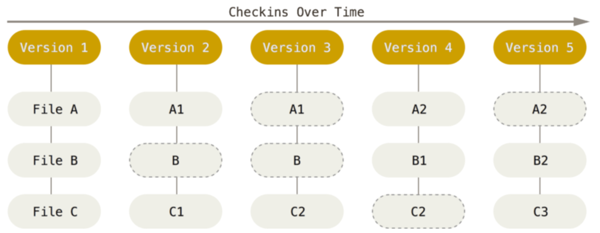
<i>Figure</i>: <u>Git stocke des snapshots de l'ensemble du projet à chaque commit</u>

Git va considerer les donnees comme un systeme de fichiers a part entiere, pour etre efficace git enregistre des references lorsque les fichiers n'ont pas change au moment d'une sauvegarde.

### Les operations de base de Git sont quasiment toutes locales

Lorsqu'on travaille avec Git on dispose de la totalité de l'historique du projet en local, ce qui permet d'effectuer des opérations très rapidement.

### Git permet aussi de garantir l'intégrité des données

Tout est verifier par une `checksum` (somme de controle), qui est une sorte de clé unique générée par un algorithme de hashage. Git utilise le SHA-1 pour générer cette clé.

Voici un exemple d'empreinte SHA-1:

```
24b9da6552252987aa493b52f8696cd6d3b00373
```

C'est une clé de 40 caractères hexadecimaux et est générée à partir du contenu du fichier ou de l'ensemble des fichiers.

La validation des données par le `commit` permet de garantir l'intégrité des données. Si un fichier est corrompu, Git ne pourra pas le valider et vous avertira.

On verra plus tard qu'il est possible de revenir à un état antérieur du projet en utilisant les `commit`. (annulation d'action).

### Les 3 états de Git

Git a 3 états principaux: `committed`, `modified` et `staged`. (valide, modifié et indexé):

- `Committed` signifie que les données sont stockées dans la base de données locale.
- `Modified` signifie que le fichier a été modifié mais pas encore validé dans la base de données.
- `Staged` signifie que les modifications ont été marquées pour être incluses dans le prochain commit.

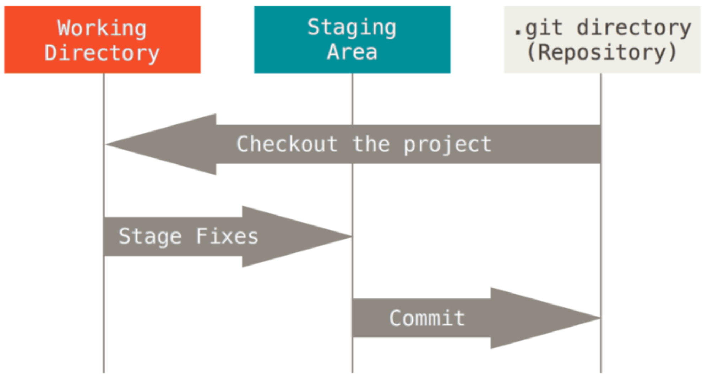

<i>Figure</i>: <u>Les 3 états de Git</u>

### Les principales commandes de Git

Pour consulter la totalite des parametrages Git :

```sh
git config --list --show-origin
```

On peut grace a `git config` modifier les parametres de Git, par exemple pour changer le nom de l'utilisateur:

```sh
git config --global user.name "John Doe"
```

ou encore pour changer l'email:

```sh
git config --global user.email mounir.bendahmane@ecole-isitech.fr
```

Pour lister vos reglages utilisateurs :

```sh
git config --list
```

#### Voici les commandes les plus courantes, on les illustre par la figure suivante:

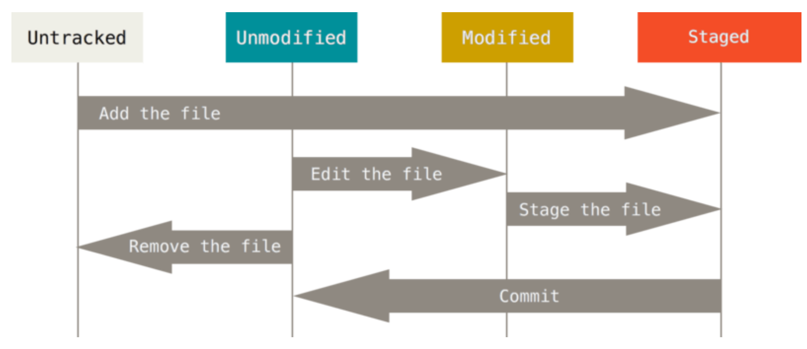]
<i>Figure</i>: <u>Les commandes Git les plus courantes</u>

- `git init` : Permet de créer un nouveau dépôt Git.
- `git clone` : Permet de cloner un dépôt existant.
- `git add` : Permet d'ajouter des fichiers à l'index.
- `git commit` : Permet de valider les modifications.
- `git status` : Permet de lister les fichiers modifiés et les fichiers qui doivent être validés.
- `git reset` : Permet de revenir à un état antérieur.

#### Ignorez des fichiers

On utilse un fichier .gitignore pour ignorer des fichiers, par exemple pour ignorer les fichiers .log:

```
*.log
```

On peut utiliser des patterns pour ignorer des fichiers, par exemple pour ignorer tous les fichiers .log et les fichiers .txt:

```
*.log
*.txt
```

Certains patterns ne sont pas recursifs, par exemple pour ignorer tous les fichiers .log dans le repertoire courant:

```
/*.log
```

On peut utliser un point d'exclamation pour forcer l'ajout d'un fichier, par exemple pour ignorer tous l

es fichiers .log sauf le fichier debug.log:

```
*.log
!debug.log
```

### Inspecter un depot (Repository)

Pour voir l'etat du depot:

```sh
git status
```

Pour voir les modifications apportées à un fichier:

```sh
git diff
```

On peut aussi utiliser `Git diff` pour voir les modifications apportées à un fichier avant de le valider:

```sh
git diff --staged (--cached)
```

On peut aussi utiliser l'outil `git tool` pour voir les modifications apportées à un fichier:

```sh
git difftool
```

### Valider les modifications

Il suffit d'utiliser la commande `git commit` pour valider les modifications:

```sh
git commit -m "Message de validation"
```

###  effacer des fichiers

Pour supprimier un fichier:

```
rm fichier.txt
```

Petit scenario: on a cree un fichier et on l'a verione, on souhaite le supprimmer du tracking git tout en le conservant phyisquement de maniere a l'inclure dans le fichier .gitignore:

```sh
git rm --cached fichier.txt
```

#### Visualier l'historique des commits

Pour visualiser l'historique des commits:

```sh
git log
```

Pour visualiser les modifications introduites par un commit avec git log:

```sh
git log -p -2
```

Pour formater la sortie de git log:

```sh
git log --pretty=oneline
```

On peut aussi formater la sortie de git log avec des options:

```sh
git log --pretty=format:"%h - %an, %ar : %s"
# en sortie on aura:
# 7e3e3e3 - Mounir Bendahmane, 2 days ago : Ajout du fichier README.md
```

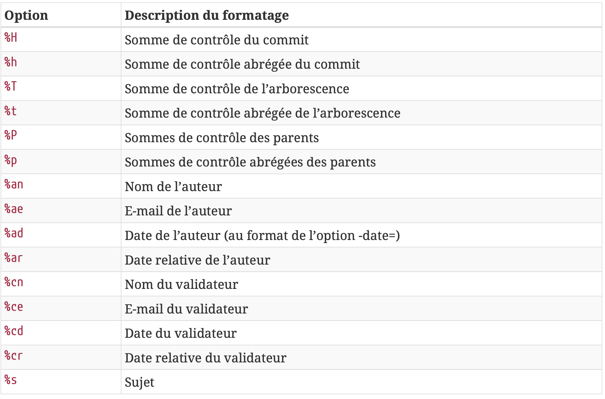
<i>Figure</i>: <u>Visualiser l'historique des commits</u>

Voici quelques commandes courantes pour travailler avec Git log :

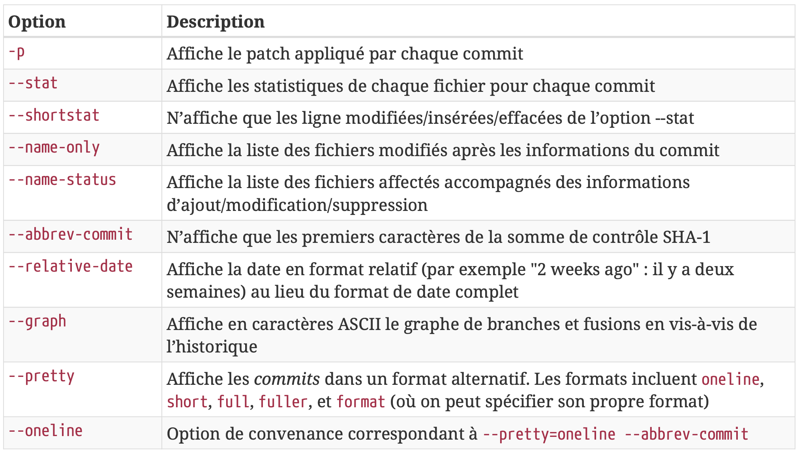

```
git log --graph --abbrev-commit --decorate --format=format:'%C(bold blue)%h%C(reset) - %C(bold green)(%ar)%C(reset) %C(white)%s%C(reset) %C(dim white)- %an%C(reset)%C(auto)%d%C(reset)'
```

### Annuler des actions

Pour annuler des actions, on peut utiliser la commande `git commit --amend`:

```sh
git commit --amend
```

Pour desindexer un fichier:

```sh
git reset HEAD fichier.txt
 # ou
git restore --staged fichier.txt

```

Attention a l'option `--hard` qui supprime les modifications:

```sh
git reset --hard HEAD
```

### Travailler un depot distant

On utilise le terme `remote` pour désigner un dépôt distant. Pour ajouter un dépôt distant:

```sh
git remote add origin https://<url du depot>
```

Pour afficher les depots distants:

```sh
git remote -v
# on obtient:
origin  https://<url du depot> (fetch)
origin  https://<url du depot> (push)
```

Pour recuperer les modifications d'un depot distant:

```sh
git pull
```

Pour obtenir des informations sur un depot distant:

```sh
git fetch [nom du remote]
```

La difference entre `git pull` et `git fetch` est que `git pull` recupere les modifications et les fusionne avec le depot local, alors que `git fetch` recupere les modifications sans les fusionner.

### Push les modifications

Pour envoyer les modifications sur le depot distant:

```sh
git push origin master

git push -u (--set-upstream) origin master
```

### Inspecter un depot distant

Pour voir les informations sur un depot distant:

```sh
git remote show <nom du remote>
# On obtient:
* remote origin
  Fetch URL: https://<url du depot>
  Push  URL: https://<url du depot>
  HEAD branch: master
  Remote branch:
    master tracked
  Local branch configured for 'git pull':
    master merges with remote master
  Local ref configured for 'git push':
    master pushes to master (up to date)
```

### Les tags

Pour lister les tags:

```sh
git tag
v1.0.0
v1.0.1
v1.0.2
```

En general on utilise les tags pour marquer des versions stables du projet.

Petit rappel sur le versionning semantique:

```
<major>.<minor>.<patch>
```

Si on a beaucoup de tags :

```
git tag -l "v1.0.*"
```

Il existe deux types de tags:

- Les tags légers
- Les tags annotés

Physiquement un tag leger est un pointeur vers un commit donné.

Un tag annoté est un objet git complet, il contient le nom de l'auteur, l'email, la date et un message:

```
git tag -a v1.0.0 -m "Version 1.0.0"
```

On peut visualiser avec plus de details les tags annotes avec la commande `git show <tag>`.

#### Push des tags

Par defaut Git ne push pas les tags vers un remote, il faut utiliser :

```bash
git push <remote> [nom du tag]
```

On peut aussi utiliser l'option `--tags` avec `git push` pour push toutes les etiquettes d'un coup!

#### Suppression d'un tag

```
git tag -d <nom du tag>
```

```
git push origin --delete <nom du tag>
```

### Les branches avec Git

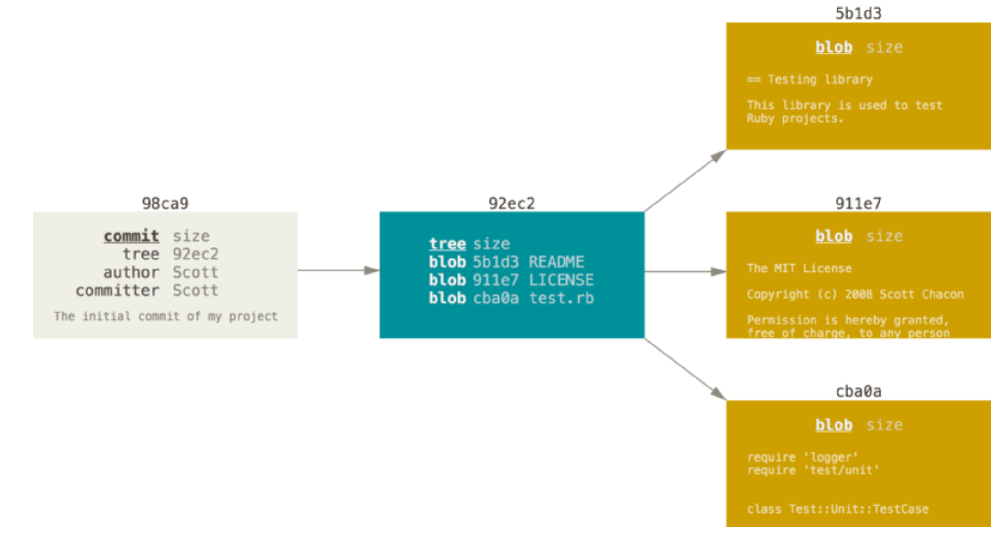

### Petit scenario sur les fusions de branche

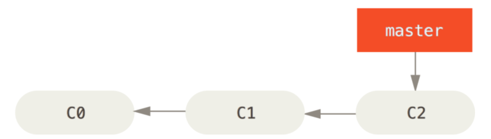

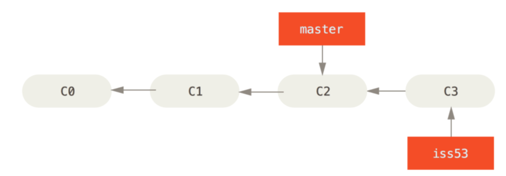

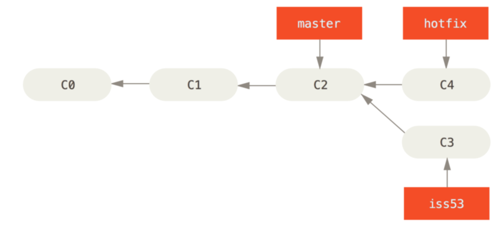

Dans ce contexte nous allons merge hotfix dans master:

```
git checkout master

git merge hotfix

# on obtient
Updating ...
Fast-Forward
    ...
```

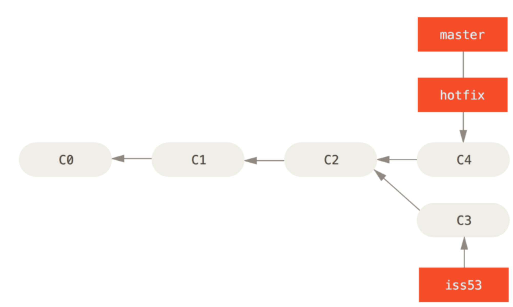

On peut maintenant supprimer `hotfix`

```
git branch -d hotfix
```

Ensuite rebasculez sur la branche de l'issue et effectuez un nouveau commit:

```
git checkout iss53
...
```

On obtient la figure suivante:

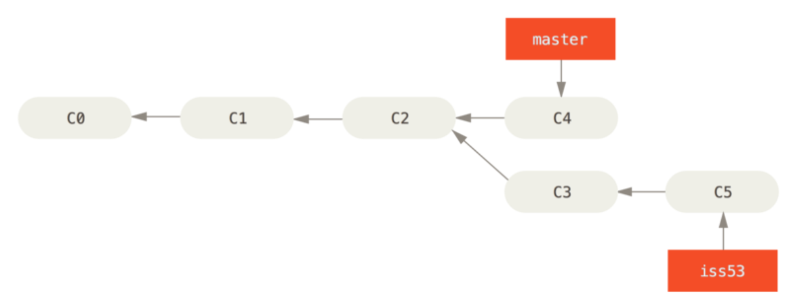

On veut maintenant merge la branche issue dans master :

```bash
git checkout master
git merge iss53
# On obitent un message de ce type
Merge made by the recursive strategy.
```

La strategie de merge se base sur le raisonnement suivant:

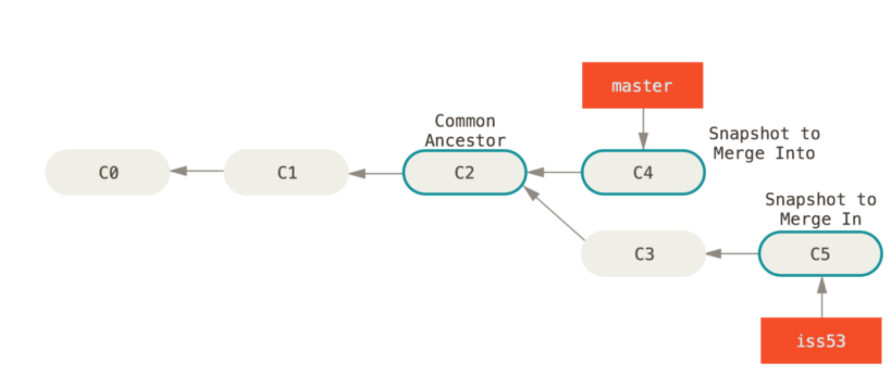

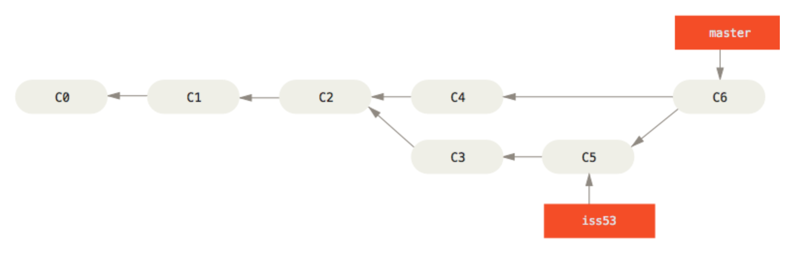

En cas de conflit, on peut voir apparaitre ce genre de morceaux de code au sein de votre repo :

```html
<<<<<<<< HEAD:index.html
<p>Bonjour</p>
========
<p>Au revoir</p>
>>>>>>>> issue01:index.html
```

### Branches et remote

Afin de lister les branches sur remote il suffit d'executer la commande:

```
git ls-remote origin

git remote show origin

git branch --all
```

#### Supprimer une branche sur remote

```
git push <nom du remote> --delete <nom de la branche>
```

### Rebasing

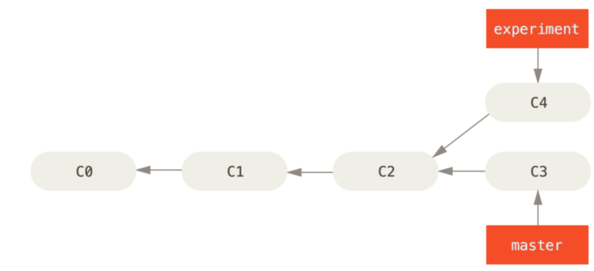

Pour effectuer un rebase on va effectuer les commandes suivantes:

```
git checkout experiment
git rebase master
```

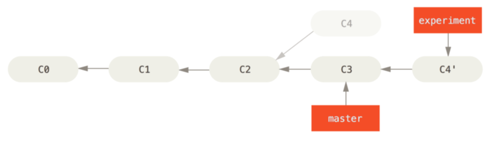

```
git checkout master
git merge experiment
```

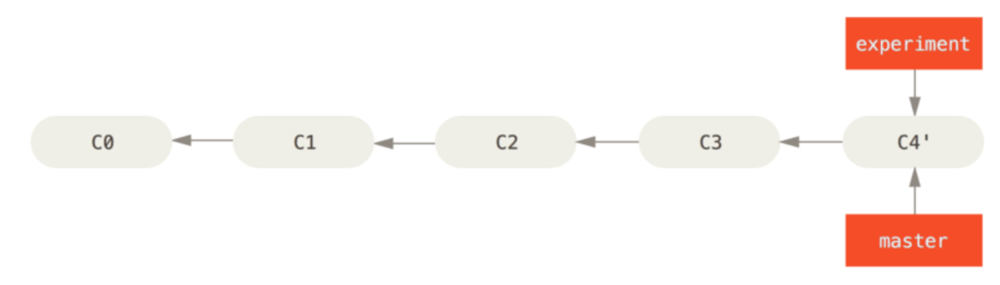

#### Petit defi sur le rebasing

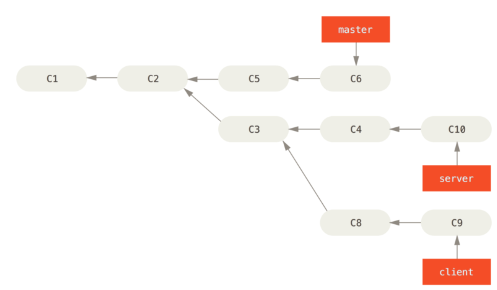

Pour rebaser client sur master:

```
git checkout client
git rebase --onto master server client
```

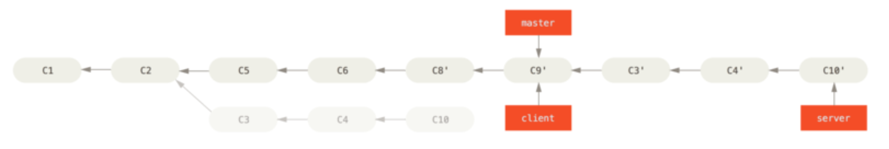

---

## CI/CD avec Github Actions

GitHub est conçu pour aider les équipes de développeurs et d’ingénieurs DevOps à créer et à déployer rapidement des applications. Il existe de nombreuses fonctionnalités dans GitHub qui permettent cela, mais elles appartiennent généralement à l’une des deux catégories suivantes :

**Communication** : prenez en compte toutes les façons dont GitHub permet à une équipe de développeurs de communiquer facilement sur le projet de développement logiciel : les révisions de code dans les requêtes de demande de tirage (pull request), les problèmes GitHub, les tableaux de projets, les wikis, les notifications, etc.

**Automatisation** : la fonctionnalité `GitHub Actions` permet à votre équipe d’automatiser des flux de travail à chaque étape du processus de développement logiciel, de l’intégration au déploiement en passant par la livraison. Elle vous permet même d’automatiser l’ajout de tags lors des pull requests, ainsi que la vérification de problèmes et demandes de tirage obsolètes.
Quand elles sont combinées, ces fonctionnalités permettent à des milliers d’équipes de développement de réduire efficacement le temps nécessaire de l’idée initiale au déploiement.

### Introduction

Github Actions est un service d'intégration et de déploiement continu (CI/CD) qui permet d'automatiser les tâches de développement.
